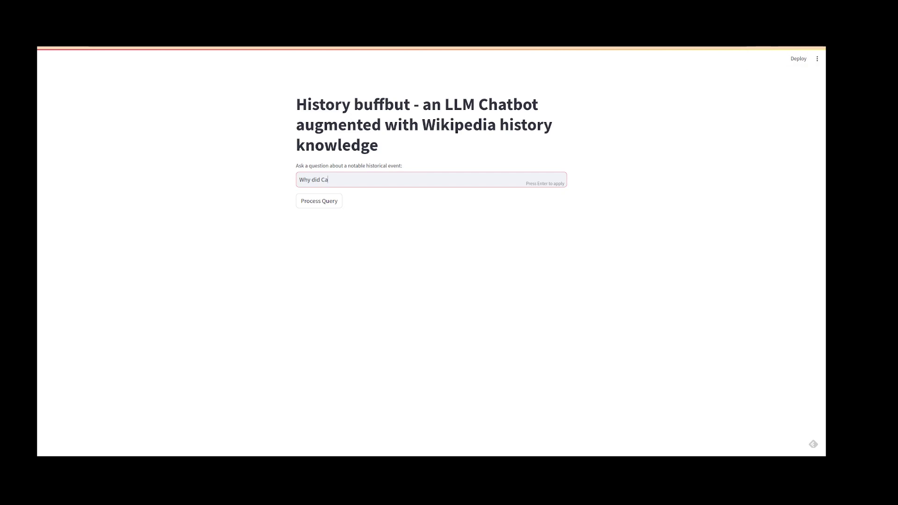

# Retrieval augmented generation demonstration

This demo allows the user to ask detailed questions about a number of events in history.

Raw data for this demo has been taken from the [Wikipedia list of "Vital Articles" for history](https://en.wikipedia.org/wiki/Wikipedia:Vital_articles/Level/4/History).
These pages contain topics Wikipedia asserts should have high quality, but not all have been assessed or meet the standard of the editors.

After a user inputs a question, the system will look up a relevant article by comparing a question to the articles which were downloaded, then it will attempt to answer the question using these articles with a process called retrieval augmented generation.

## System setup

The articles were downloaded from Wikipedia using the `download_data.py` script. Any article containing meta-information was removed, as well as any article which was not downloaded correctly.

This system consists of the following:
- a postgres server with pgvector inside a docker image
- streamlit application to respond to user queries


## Data ingestion

1. Download files from Wikipedia
    ```bash
    poetry run python3 dl_scripts/download_data.py
    ```
1. Remove less helpful files
    ```bash
    bash dl_scripts/remove_short_files.sh downloaded_articles/*.txt
    ```
1. Install poetry env
    ```bash
    poetry install
    ```
1. Download the huggingface model - N.B. this requires your credentials in the environment
    ```bash
    huggingface-cli download TheBloke/Wizard-Vicuna-7B-Uncensored-GGUF Wizard-Vicuna-7B-Uncensored.Q4_K_M.gguf --local-dir models --local-dir-use-symlinks False
    ```
1. Create the docker image locally
    ```bash
    docker build . -t history_buffbot
    ```
1. Launch the stack
    ```bash
    poetry run docker-compose up -d
    ```
1. Upload the reference files
    ```bash
    poetry run python3 db_scripts/upload_data.py downloaded_articles
    ```

## Application usage

Now navigate to [the streamlit application in your browser](http://localhost:8501) and you should be able to formulate short questions about historical events 

Example video!
[](demos/history_buffbot_demo.mp4)


### Caveat
As this is a tool for demonstrating how to perform retrieval augmented generation rather than a production ready prototype, be aware that you may have unreliable results with such a small model. 

I recommend consulting one of the community leaderboards, such as one of the following, for model suitable for production.
- [toloka's leaderboard](https://toloka.ai/llm-leaderboard/)
- [LudwigStumpp's leaderboard](https://github.com/LudwigStumpp/llm-leaderboard)
